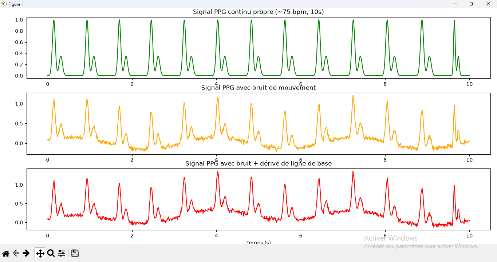
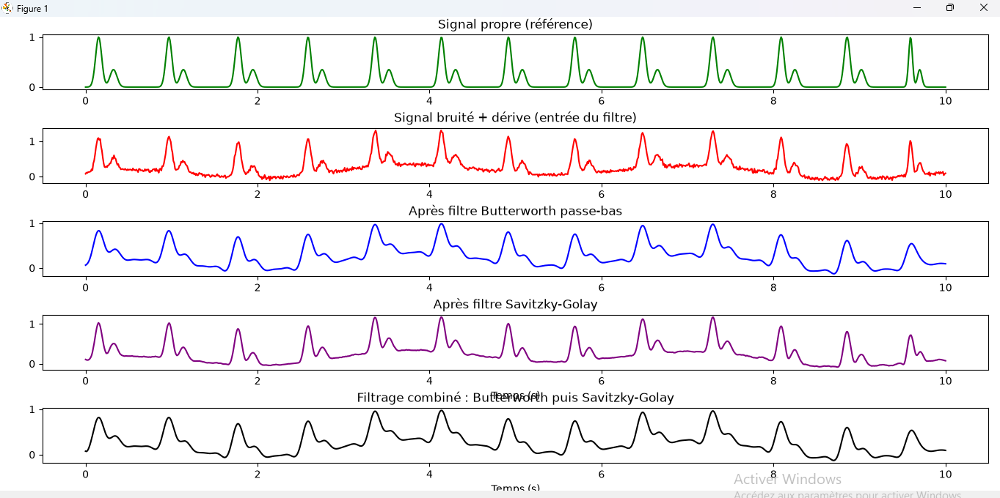
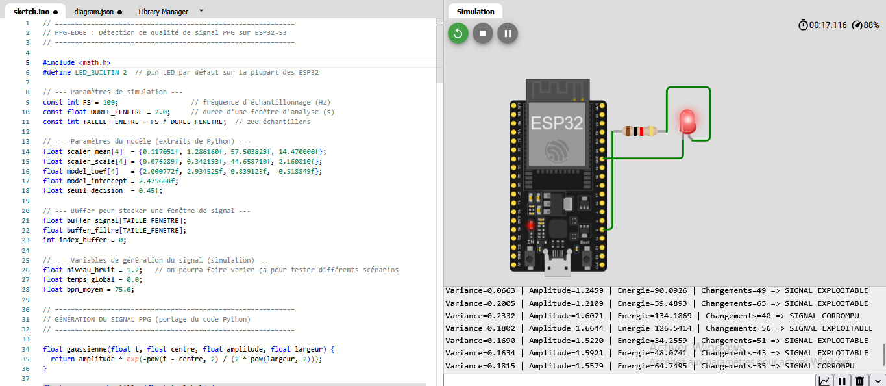

\# PPG-Edge : Détection de qualité de signal PPG en temps réel sur ESP32-S3

Pipeline complet TinyML : génération de signal PPG synthétique, traitement du signal (DSP), 

machine learning, et déploiement embarqué sur ESP32-S3 simulé (Wokwi).

\## Objectif

Détecter en temps réel si un signal PPG (photopléthysmographie) est exploitable ou trop 

corrompu par du bruit de mouvement, directement sur microcontrôleur — comme le fait une 

montre connectée.

\## Pipeline

1\. \*\*Génération de signal\*\* (`generate\_ppg.py`) : signal PPG synthétique réaliste 

&#x20;  (pic systolique, dicrotic notch, pic diastolique) via modèle gaussien

2\. \*\*Traitement du signal\*\* : filtrage Butterworth + Savitzky-Golay

3\. \*\*Dataset\*\* (`build-dataset.py`) : extraction de features (variance, amplitude, 

&#x20;  énergie, changements de signe) sur 750 fenêtres labellisées

4\. \*\*Modèle ML\*\* (`train-model.py`) : régression logistique (scikit-learn), 

&#x20;  93% accuracy, seuil de décision optimisé par F1-score

5\. \*\*Déploiement embarqué\*\* (`sketch.ino`) : portage C++ du pipeline complet 

&#x20;  (génération, filtrage, features, prédiction) sur ESP32-S3 simulé sous Wokwi

\## Résultats

\- Accuracy : 93.3%

\- F1-score (classe "corrompu") : 0.95

\- Inférence temps réel fonctionnelle sur microcontrôleur simulé

## Démonstration

### Signal PPG généré (propre, bruité, dérive)

### Filtrage du signal

### Détection en temps réel sur ESP32-S3 (Wokwi)
La LED s'allume automatiquement quand le signal est détecté comme corrompu :

\## Technologies

Python, NumPy, SciPy, scikit-learn, C++ (Arduino), ESP32-S3, Wokwi

\## Auteur

Ilias El Ouedar — Étudiant en Électronique et Électrotechnique, ENSEEIHT (N7)

